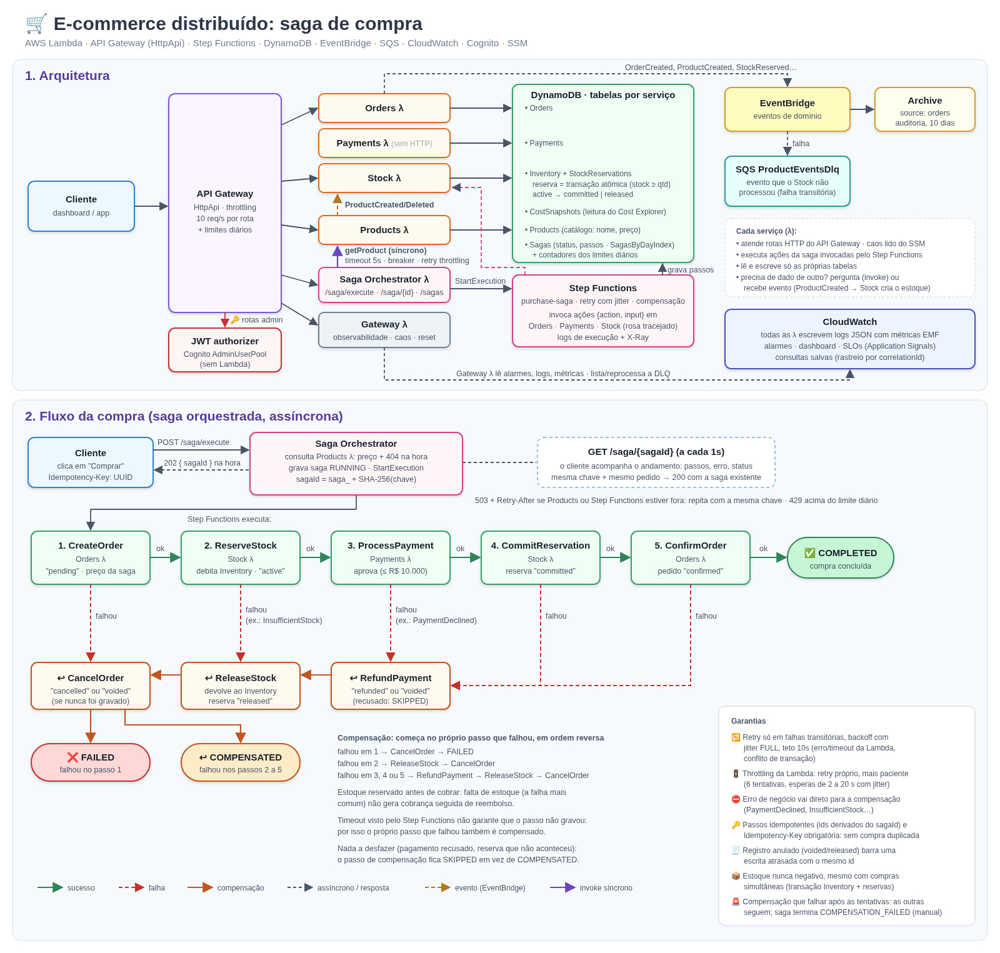
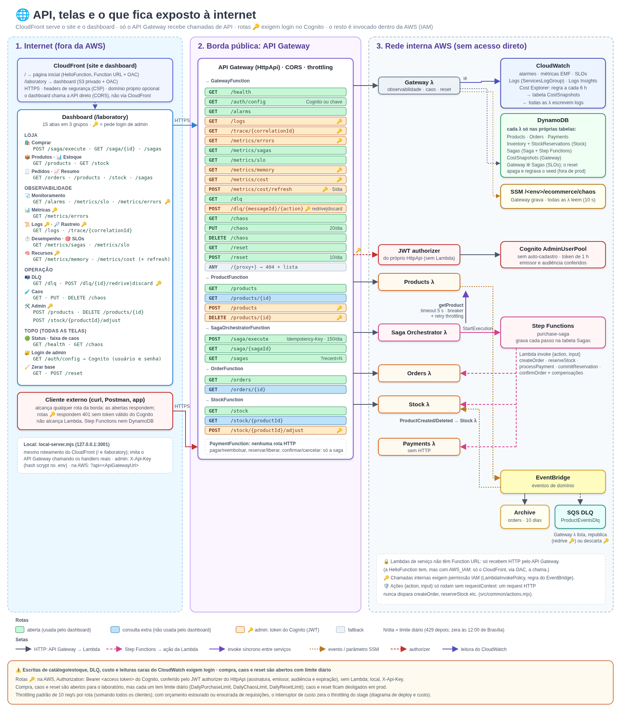
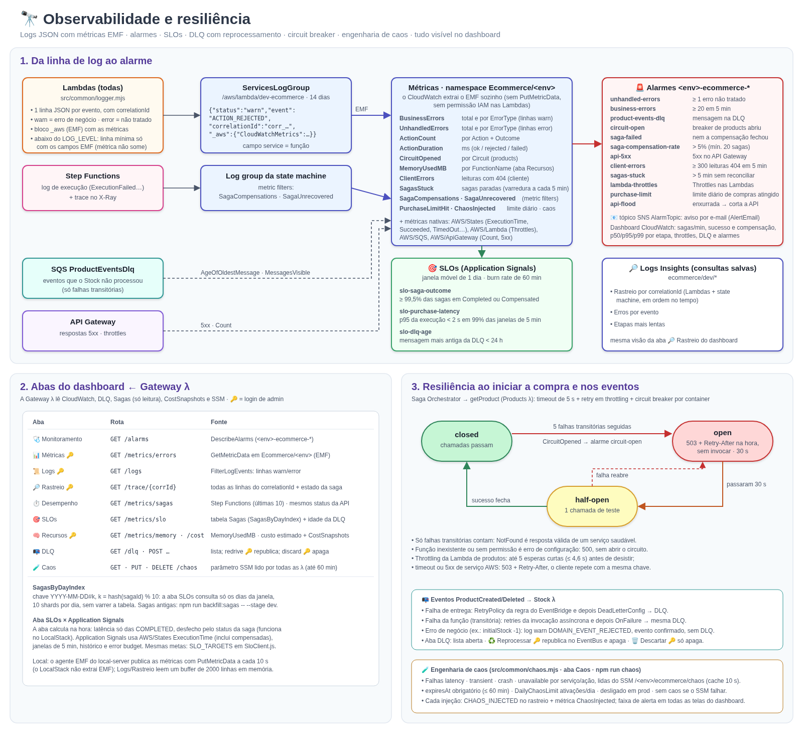
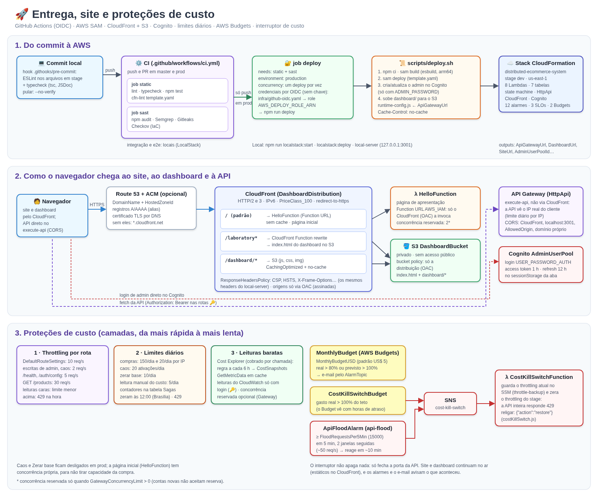

# Diagramas e documentação

Ponto de entrada da documentação do laboratório. O [README principal](../README.md)
é a referência completa; aqui ficam os diagramas e o mapa dos demais documentos.
Os mesmos diagramas aparecem na aba **Diagramas** do dashboard
(`/laboratory#/diagrams`), servidos desta pasta em `/dashboard/diagramas/`.

## Diagramas

Clique na imagem para abrir o SVG em tamanho real.

| Diagrama | O que mostra |
|---|---|
| [Arquitetura e saga de compra](#arquitetura-e-saga-de-compra) | Serviços, tabelas por serviço, eventos, Step Functions e o fluxo da compra com as compensações |
| [API, telas e exposição](#api-telas-e-exposição) | Todas as rotas do HttpApi por Lambda, quais exigem login (Cognito), as abas do dashboard e o que é invocado só por dentro da AWS |
| [Observabilidade e resiliência](#observabilidade-e-resiliência) | Da linha de log JSON (EMF) às métricas, alarmes e SLOs; abas do dashboard; circuit breaker, DLQ e caos |
| [Entrega, site e custo](#entrega-site-e-proteções-de-custo) | CI/CD (GitHub Actions + OIDC), `deploy.sh`, CloudFront + S3 + página inicial e as camadas de proteção de custo |

### Arquitetura e saga de compra

[](arquitetura-e-saga.svg)

### API, telas e exposição

[](api-e-telas.svg)

### Observabilidade e resiliência

[](observabilidade.svg)

### Entrega, site e proteções de custo

[](deploy-e-custo.svg)

## Documentos

| Documento | Conteúdo |
|---|---|
| [README.md](../README.md) | Visão geral, saga, observabilidade, API, segurança, caos e comandos |
| [src/ecommerce/saga-orchestrator/README.md](../src/ecommerce/saga-orchestrator/README.md) | A saga em detalhe: passos, compensações, garantias e o registro na tabela Sagas |
| [README-LOCALSTACK.md](../README-LOCALSTACK.md) | Rodar tudo localmente (LocalStack + `local-server`) |
| [AWS-SETUP.md](../AWS-SETUP.md) | Deploy na AWS (manual e automático pelo GitHub Actions), recursos criados, testes, logs, SLOs e custo |

## Atualizando os diagramas

Os SVGs são a fonte (texto, versionável); os PNGs são renderizações deles para o
README. Depois de editar um SVG, gere o PNG de novo no mesmo tamanho do
`viewBox`, por exemplo com o Chrome headless:

```bash
google-chrome --headless=new --hide-scrollbars --force-device-scale-factor=1 \
  --window-size=1600,<altura+200> --screenshot=diagramas/<nome>.png diagramas/<nome>.svg
# e corte a sobra de baixo até a altura do viewBox
```

Mudou rota, autenticação, alarme, limite ou serviço? Atualize o diagrama
correspondente no mesmo commit.
